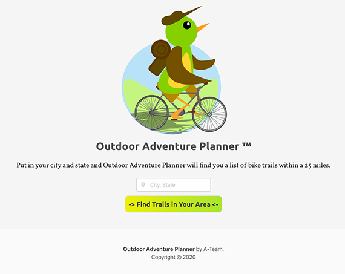

## Outdoor Bike Planner
A bike app that allows users to find local bike trails based on the location they input. The weather information for the selected location will also be displayed.

## Features

* Location can be searched by City and State as well as by zip code.
* Weather conditions available for selected location.
* Trail information provided:
  * Description
  * Trail Length
  * Trail Rating
  * Trial Directions
  * Link to more detailed info

## Screenshots

## Technologies

<b>Project Created With</b>
- [Bulma](https://bulma.io/)
- [jQuery](https://jquery.com/)
- [Javascript](https://www.javascript.com/)
- [Google Maps API](https://cloud.google.com/maps-platform/?utm_source=google&utm_medium=cpc&utm_campaign=FY18-Q2-global-demandgen-paidsearchonnetworkhouseads-cs-maps_contactsal_saf&utm_content=text-ad-none-none-DEV_c-CRE_460848633508-ADGP_Hybrid%20%7C%20AW%20SEM%20%7C%20BKWS%20~%20Google%20Maps%20API-KWID_43700033921822021-aud-581578347266%3Akwd-335425467-userloc_9009736&utm_term=KW_google%20maps%20api-ST_google%20maps%20api&gclid=Cj0KCQjwufn8BRCwARIsAKzP6942zLnpnYC4_QhHtN_2rQA0nKAltMXm7PIUIsfDceLf3gfpOpcKLvUaAg3FEALw_wcB)
- [TrailsAPI](https://rapidapi.com/trailapi/api/trailapi/details)
- [OpenWeather API](https://openweathermap.org/api)

## Link to deployed application 

[Outdoor Adventure Planner](https://meddle74.github.io/bikeTrailAdvisor/)

## Credits
* [Bart Cusick](https://github.com/bartcusick) - Custom graphics and CSS styling
* [Grayson Stricker](https://github.com/g-strick) - OpenWeather and Trail API integration
* [Kyle Ward](https://github.com/kyleward92) - Bulma CSS integration
* [Patrick Lloyd](https://github.com/Meddle74) - Google Maps API  & Trail API integration

## License

[MIT License](https://opensource.org/licenses/MIT)
